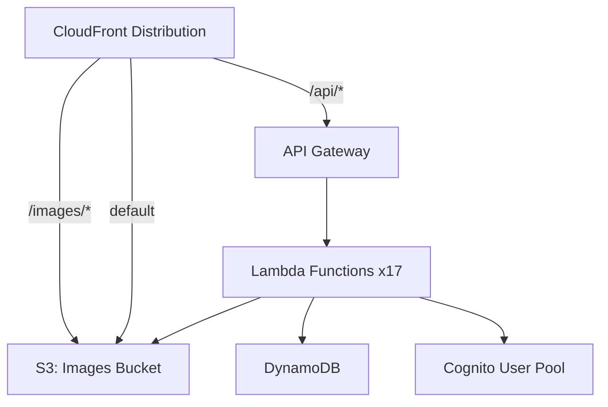
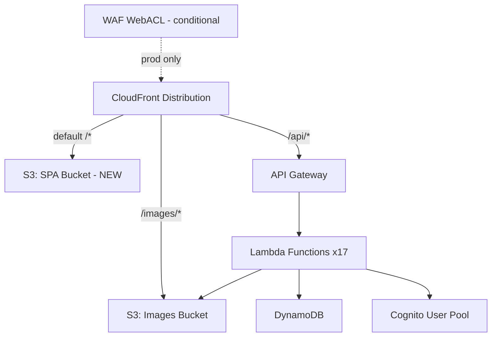

# Design Document: AWS Deployment

## Overview

This design covers the infrastructure changes and tooling needed to deploy the Highland Oak Neighborhood Board to AWS. The app is already well-architected for serverless — the primary gaps are: (1) no SPA hosting bucket in the SAM template, (2) CloudFront only has image + API origins but no SPA origin, (3) no deployment IAM policy, (4) no verification tooling, and (5) WAF costs need optimization for dev environments.

The approach is to modify the existing `backend/template.yaml` to add the missing resources, create supporting deployment scripts and documentation, and update the CI/CD workflows to reference the correct bucket names from stack outputs.

## Architecture

### Current State



### Target State



Key changes:
- New S3 bucket for SPA static files (default CloudFront origin)
- CloudFront default behavior points to SPA bucket instead of images bucket
- Images bucket moved to `/images/*` path pattern
- WAF made conditional on Stage parameter (prod only)
- Custom domain parameters added (optional)

## Components and Interfaces

### 1. SAM Template Changes (`backend/template.yaml`)

#### New Resources

**SpaBucket** (AWS::S3::Bucket):
- Bucket name: `highland-oak-spa-{stage}-{accountId}`
- Public access fully blocked
- No versioning (static build artifacts are disposable)
- No lifecycle rules (files replaced on each deploy)

**SpaBucketPolicy** (AWS::S3::BucketPolicy):
- Grants `s3:GetObject` to the existing CloudFront OAI only

#### Modified Resources

**CloudFrontDistribution**:
- Add new S3 origin `SpaOrigin` pointing to SpaBucket
- Change `DefaultCacheBehavior` to target `SpaOrigin` (was targeting images S3Origin)
- Add new `CacheBehavior` for `/images/*` targeting the existing images S3Origin
- Keep existing `/api/*` behavior unchanged
- `CustomErrorResponses` for 403/404 → `/index.html` already exist (for SPA routing) — these stay as-is and now correctly serve from the SPA bucket

**WebACL + WAF Rule**:
- Wrap in `AWS::CloudFormation::Condition` — only create when `Stage=prod`
- CloudFront `WebACLId` becomes conditional: `!If [IsProd, !GetAtt WebACL.Arn, !Ref "AWS::NoValue"]`

#### New Parameters

| Parameter | Type | Default | Description |
|-----------|------|---------|-------------|
| DomainName | String | "" | Custom domain (optional) |
| CertificateArn | String | "" | ACM certificate ARN (optional, us-east-1) |

#### New Conditions

| Condition | Expression | Purpose |
|-----------|-----------|---------|
| HasCustomDomain | `!Not [!Equals [!Ref DomainName, ""]]` | Enable custom domain config |
| IsProd | Already exists | Gate WAF creation |

#### New Outputs

| Output | Value | Purpose |
|--------|-------|---------|
| SpaBucketName | `!Ref SpaBucket` | Frontend deploy target |

### 2. IAM Deployer Policy (`backend/deployment/deployer-policy.json`)

A JSON IAM policy document with the minimum permissions for SAM deploy. Organized by service:

- **CloudFormation**: `CreateStack`, `UpdateStack`, `DescribeStacks`, `DescribeStackEvents`, `GetTemplate`, `DeleteStack`, `CreateChangeSet`, `ExecuteChangeSet`, `DescribeChangeSet`, `ListStackResources`
- **S3**: Full access to SAM artifact bucket (`highland-oak-*`) and the SPA/images buckets
- **Lambda**: `CreateFunction`, `UpdateFunctionCode`, `UpdateFunctionConfiguration`, `DeleteFunction`, `AddPermission`, `RemovePermission`, `GetFunction`, `ListVersionsByFunction`, `PublishLayerVersion`, `GetLayerVersion`
- **API Gateway**: `CreateApi`, `UpdateApi`, `DeleteApi`, `CreateStage`, `UpdateStage`, `CreateRoute`, `UpdateRoute`, `CreateIntegration`, `UpdateIntegration`
- **DynamoDB**: `CreateTable`, `UpdateTable`, `DeleteTable`, `DescribeTable`, `TagResource`
- **Cognito**: `CreateUserPool`, `UpdateUserPool`, `DeleteUserPool`, `CreateUserPoolClient`, `UpdateUserPoolClient`
- **CloudFront**: `CreateDistribution`, `UpdateDistribution`, `GetDistribution`, `CreateInvalidation`, `CreateCloudFrontOriginAccessIdentity`
- **WAFv2**: `CreateWebACL`, `UpdateWebACL`, `DeleteWebACL`, `AssociateWebACL`, `DisassociateWebACL` (scoped to `highland-oak-*`)
- **IAM**: `CreateRole`, `DeleteRole`, `AttachRolePolicy`, `DetachRolePolicy`, `PutRolePolicy`, `DeleteRolePolicy`, `PassRole` (scoped to `highland-oak-*` roles)
- **CloudWatch Logs**: `CreateLogGroup`, `DeleteLogGroup`, `PutRetentionPolicy`

All resources scoped with conditions where possible (resource ARN patterns, tag conditions).

### 3. Verification Script (`backend/deployment/verify-deployment.sh`)

A bash script that:
1. Accepts stack name as argument (default: `highland-oak-prod`)
2. Queries CloudFormation outputs via `aws cloudformation describe-stacks`
3. Runs checks:
   - Stack outputs are non-empty
   - `curl -s` the API `/posts` endpoint → expect HTTP 200
   - `curl -s` the CloudFront domain root → expect HTML containing `<div id="root">`
   - `aws s3 ls` the SPA bucket → expect `index.html` present
4. Outputs pass/fail for each check with remediation hints on failure
5. Exits with code 0 if all pass, 1 if any fail

### 4. Secrets Checklist (`backend/deployment/secrets-checklist.md`)

A markdown document listing each GitHub Actions secret:

| Secret | Source | Purpose |
|--------|--------|---------|
| AWS_ACCESS_KEY_ID | IAM console → Deployer user | AWS authentication |
| AWS_SECRET_ACCESS_KEY | IAM console → Deployer user | AWS authentication |
| AWS_REGION | Manual (e.g., `us-east-1`) | Target region |
| S3_BUCKET_NAME | Stack output: `SpaBucketName` | Frontend deploy target |
| CLOUDFRONT_DISTRIBUTION_ID | Stack output: `CloudFrontDistributionId` | Cache invalidation |
| CLOUDFRONT_DOMAIN | Stack output: `CloudFrontDomain` | E2E test base URL |
| VITE_API_URL | Stack output: `ApiUrl` | Frontend API endpoint |
| VITE_CDN_URL | Stack output: `CloudFrontDomain` | Frontend CDN URL for images |
| ALLOWED_ORIGIN | CloudFront domain or custom domain | CORS origin for backend |

### 5. CI/CD Workflow Updates

**`backend.yml`** — No structural changes needed. Already uses `sam build --use-container` + `sam deploy`. Just needs the correct secrets configured.

**`frontend.yml`** — Already correctly structured. The `S3_BUCKET_NAME` secret needs to point to the new SPA bucket (not the images bucket). No code changes needed, just correct secret values.

**`pr-checks.yml`** — No changes needed.

## Data Models

This is an infrastructure/deployment spec — there are no new data models. The existing DynamoDB single-table design, Cognito user pool schema, and S3 object structure remain unchanged.

The only "data" artifacts are:
- **SAM Parameters**: `Stage`, `AllowedOrigin`, `DomainName`, `CertificateArn`
- **Stack Outputs**: `ApiUrl`, `UserPoolId`, `UserPoolClientId`, `TableName`, `ImagesBucketName`, `SpaBucketName`, `CloudFrontDomain`, `CloudFrontDistributionId`
- **GitHub Secrets**: Key-value pairs stored in GitHub repository settings


## Correctness Properties

*A property is a characteristic or behavior that should hold true across all valid executions of a system — essentially, a formal statement about what the system should do. Properties serve as the bridge between human-readable specifications and machine-verifiable correctness guarantees.*

Since this is an infrastructure/deployment spec, most acceptance criteria are structural checks on configuration files (YAML, JSON) rather than runtime behavior. The testable properties focus on invariants that must hold across all resources of a given type in the SAM template and across all statements in the IAM policy.

### Property 1: Deployer policy completeness and scoping

*For any* statement in the deployer policy JSON, the policy as a whole SHALL contain actions covering CloudFormation, S3, Lambda, API Gateway, DynamoDB, Cognito, CloudFront, WAFv2, IAM, and CloudWatch Logs, AND every resource ARN pattern in the policy SHALL contain "highland-oak" or use a scoped ARN pattern (not `*` at the account level).

**Validates: Requirements 2.1, 2.2**

### Property 2: Lambda cost optimization configuration

*For any* Lambda function resource defined in the SAM template, the function SHALL have architecture set to `arm64`, memory size ≤ 256 MB (except functions with "image-processor" in the name which may use up to 1024 MB), timeout ≤ 29 seconds (except image processor which may use up to 60 seconds), and the environment variable `AWS_NODEJS_CONNECTION_REUSE_ENABLED` set to `"1"`.

**Validates: Requirements 6.1, 6.7**

### Property 3: Verification script output validation

*For any* set of CloudFormation stack outputs (represented as key-value pairs), when the verification script parses the outputs, it SHALL correctly identify all outputs with empty values and report them as failures.

**Validates: Requirements 8.1**

### Property 4: Verification script error reporting

*For any* verification check that fails (API unreachable, CloudFront not serving SPA, missing index.html, empty stack outputs), the script's error output SHALL contain the name of the failing component and a non-empty remediation suggestion.

**Validates: Requirements 8.5**

## Error Handling

### SAM Deploy Failures

| Error | Cause | Remediation |
|-------|-------|-------------|
| `CREATE_FAILED` on SpaBucket | Bucket name collision (globally unique) | The template uses `{stage}-{accountId}` suffix to ensure uniqueness. If collision occurs, change the stage name. |
| `CREATE_FAILED` on WAF | WAF must be in `us-east-1` for CloudFront | Ensure the stack is deployed in `us-east-1`, or deploy WAF in a separate us-east-1 stack. The template already scopes WAF to CLOUDFRONT. |
| `UPDATE_ROLLBACK_COMPLETE` | Failed update rolled back | Check CloudFormation events for the specific resource that failed. Common cause: Lambda code packaging errors. Run `sam build --use-container` to ensure clean builds. |
| Circular dependency on S3 notification | S3 bucket and Lambda permission reference each other | Already handled in template with explicit `AWS::Lambda::Permission` resource. |

### CI/CD Pipeline Failures

| Error | Cause | Remediation |
|-------|-------|-------------|
| AWS credentials invalid | Expired or incorrect secrets | Rotate IAM access keys and update GitHub secrets. |
| S3 sync fails | Wrong bucket name in secrets | Verify `S3_BUCKET_NAME` matches Stack Output `SpaBucketName`. |
| CloudFront invalidation fails | Wrong distribution ID | Verify `CLOUDFRONT_DISTRIBUTION_ID` matches Stack Output. |
| `sam build` fails | Docker not available | The workflow uses `--use-container` which requires Docker. GitHub Actions ubuntu-latest includes Docker. |

### Verification Script Failures

The script outputs structured error messages:
```
[FAIL] API Health Check - GET /posts returned HTTP 503
  → Remediation: Check Lambda function logs in CloudWatch. Verify DynamoDB table exists.

[FAIL] CloudFront SPA - Root request did not return index.html
  → Remediation: Verify frontend was deployed to SPA bucket. Run: aws s3 ls s3://<spa-bucket>/

[PASS] Stack Outputs - All 8 outputs present
[PASS] SPA Bucket - index.html exists
```

## Testing Strategy

### Infrastructure Testing

Since this is a deployment/infrastructure spec, testing focuses on configuration validation rather than runtime behavior.

**Unit Tests (Vitest)**:
- Parse `backend/template.yaml` and validate structural requirements (origins, behaviors, conditions, outputs)
- Parse `backend/deployment/deployer-policy.json` and validate required actions and resource scoping
- Test verification script output parsing logic with mocked AWS CLI responses
- Test error message formatting for each failure scenario

**Property-Based Tests (fast-check)**:
- Property 1: Generate random subsets of IAM actions and verify the deployer policy covers all required services
- Property 2: Parse all Lambda function resources from the template and verify cost optimization settings
- Property 3: Generate random sets of stack outputs (some empty, some populated) and verify the script correctly identifies failures
- Property 4: Generate random failure scenarios and verify error messages contain component names and remediation text

**Integration Tests (manual, post-deploy)**:
- Run `sam deploy` against a dev stack and verify all resources created
- Run the verification script against the deployed stack
- Verify the frontend loads at the CloudFront URL
- Verify API calls work through CloudFront → API Gateway → Lambda

**Property-Based Testing Configuration**:
- Library: `fast-check` (already used in the project)
- Minimum 100 iterations per property test
- Test files: `backend/deployment/__tests__/template.property.spec.mjs`
- Tag format: `Feature: aws-deployment, Property N: {property_text}`
